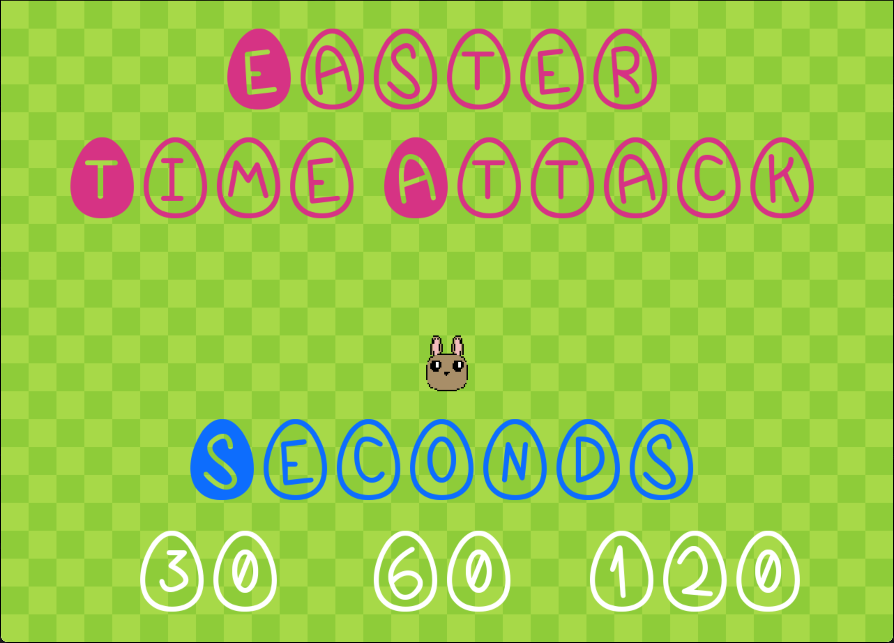
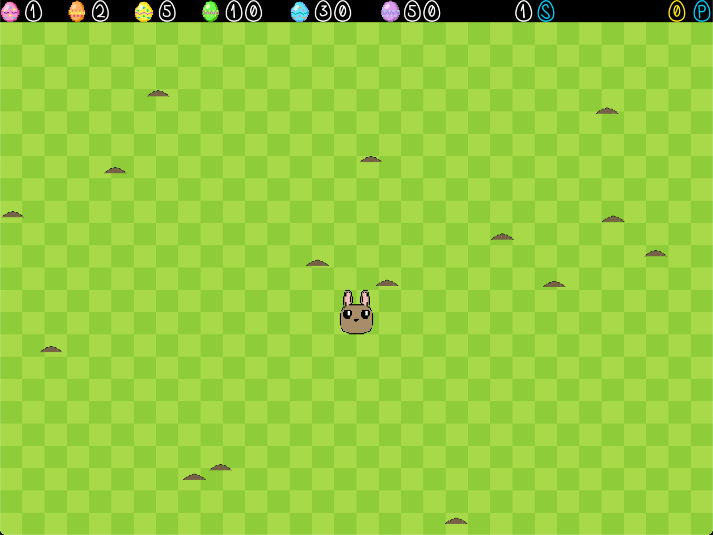
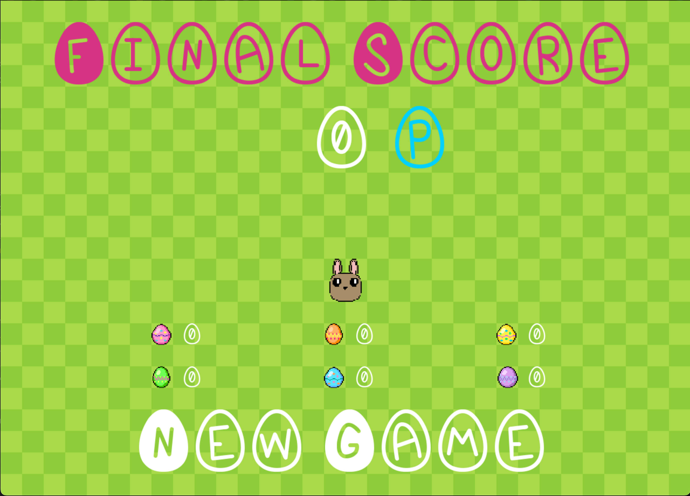

# Easter Time Attack
This a reposetory for the CodeArcade Challenge presented by Prosa.
The 'Resultatvideo' is a demonstration of running the program. The video is recorded in the MOV container format, which most media players support including VLC.

# Dependencies
This challenge is written in C# and uses .NET 6.0 as well as the SDL2 package:
* SDL2
* SDL2_ttf
* SDL2_mixer

# The Game
The challenge can be run using the command: `dotnet run` with the .NET CLI and SDL2 package installed and being stationed in the folder with the `.csproj` file.

## Controls
Each menu only supports mouse click to choose options.

When playing, the rabbit is controlled using either WASD or the keyboard arrows.

## Game Idea
The idea is to get as many eggs as possible before the time runs out. When playing, small earch bumps will show up on the lawn. Running into these bumps will yield you a random type of easter egg - with better eggs being harder to find. Each egg is worth a certain amount of points.

## Game Design
The game is designed using both F2U resources and resources created by me. 

### Main Menu
The main manu allows you to choose 1 of three game times:
* 30 seconds
* 60 seconds
* 120 seconds

### Gameplay
When playing the remaining time and current score is shown at the top right of the screen.

## Final Score
When the time is up, the final score is shown and you can see how many of each easter egg you have collected.

After checking your final score you can start a new game.

